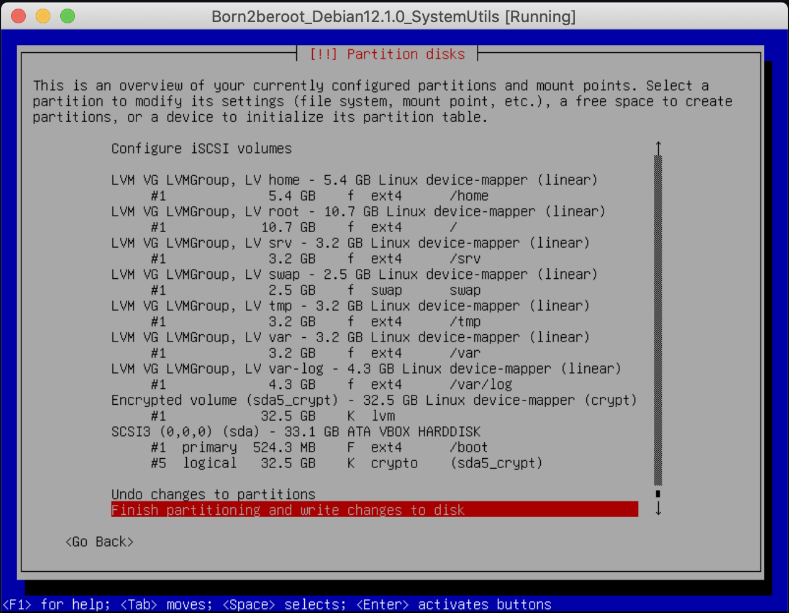
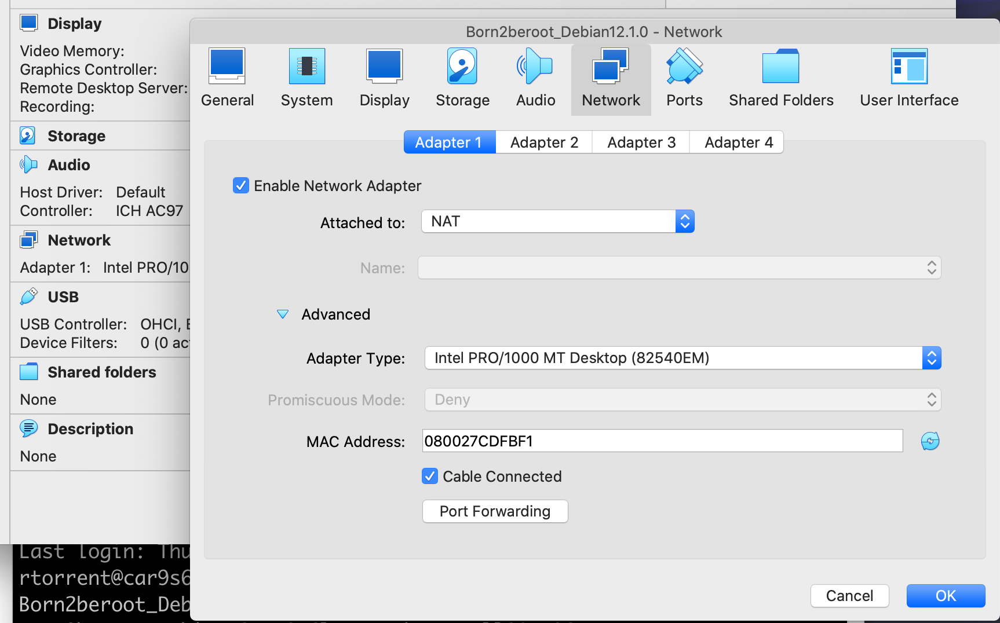
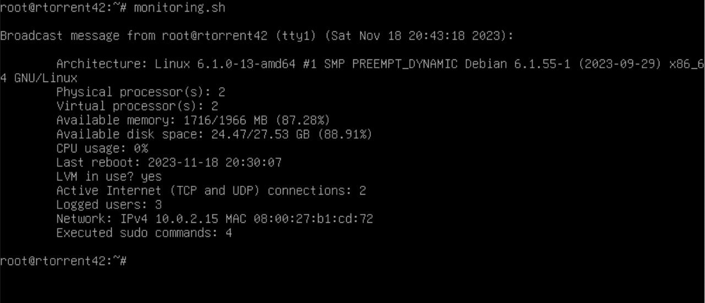

# Born2beroot

**Guide to solve common-core-rank01/Born2beroot (version 2) project, *mandatory* & *bonus* parts.**

Operating system: **Debian "Bookworm" v12.1.0** 
Virtualization software: **Oracle VM VirtualBox v7.0.8**

**NOTES**:
- User login throughout this file is `rtorrent`.
- Any login, filename, password, or such marked with a (§) can and ***should*** be adapted to the user's personal preferences.
- A text file with user, root, and partition passwords should be kept at hand.
- Popular text editors available with the bare Debian build are **vi** and **nano**. **Emacs** requires an installation (`apt install emacs`) first. Commands in this tutorial reliant on the choice of a text editor are marked with (†).

---

## A. Installing our virtual machine & setting the server

[Download](https://cdimage.debian.org/debian-cd/current/amd64/iso-cd/) the latest *stable* version of Debian. Currently, this will be image `debian-12.1.0-amd64-netinst.iso`.

Open VirtualBox and select **`New`**.

- You may determine your VirtualBox release version by executing in the CLI
> VBoxManage -v

---

### A.1 VirtualBox Settings

#### A.1.a Name and Operating System

> Name: `Born2beroot_Debian12.1.0` (§) 
> Folder: `cd /System/Volumes/Data/sgoinfre/Perso/rtorrent/` (§)
- Actual location of the `SGoinfre` folder in the 42 system might vary. A symbolic link in the root directory, `/sgoinfre`, is probably present.
- User's folder in the public directory may be further protected: `chmod go-rwx rtorrent` (§). Check the local rules governing `SGoinfre` in the `F.A.Q.` link of the *intra*.
> ISO Image: Probably located in the student's `Downloads` folder.
- Further boxes will autofill.
> `Skip Unattended Installation` **✓** this box

#### A.1.b Hardware

> Base Memory: Leave as recommended, 2048 MB. 
> Processors: In my experience, OS installation at 42's facilities ***will crash*** with more than `1` CPU selected. We *may* choose to increase the number after the installation is complete.

#### A.1.c Hard Disk

> `Create a Virtual Hard Disk Now` **☉** this button
- Hard Disk File location for the .vdi (VirtualBox Disk Image) should be automatically selected in our VM's folder.
- Increase size to `30.80 GB` for the *bonus* sections of this project. 
  [**NOTE**: Both Debian and VirtualBox use the *traditional* 1 GB = (1,024)^3 = 1,073,741,824 bytes. However, Debian's installer uses the *modern* 1 GB = 1,000,000,000 bytes, perhaps to accomodate hardware manufacturers' scheming of inflated HD sizes.]
- Do not *Pre-allocate Full Size*, as you will exceed your assigned space quota in disk.

After pressing **`Finish`**, the VM should be created in the `sgoinfre` subfolder of our choosing.

**`Start`** the VM.
- At all times, one can switch from the host to the guest sytem, and back, by pressing the `⌘` key.

---

### A.2 Installing Debian

**IMPORTANT: Immediately press the `↓` key in the keyboard to interrupt the *Graphic install* option. Select the *Install* option instead.**

Before continuing, resize the Machine's Window by pressing `⌘ + C`. Use the mouse to adjust the window to a comfortable size.

#### A.2.a Select a language

> Language: `English - English`

#### A.2.b Select your location

> Country, territory or area: `other` (§) 
> Continent or region: `Europe` (§) 
> Country, territory or area: `Spain` (§)

#### A.2.c Configure locales

> Country to base default locale settings on: `United States - en_US.UTF-8`

#### A.2.d Configure the keyboard

> Keymap to use: `American English`

#### A.2.e Configure the network

> Hostname: `rtorrent42` (§)
- As per instructions, hostname ***must*** be the user's 42 login ending with 42.
> Domain name: ` ` \<leave empty\>

#### A.2.f Set up users and passwords

> Root password: `Born2berude` (§) 
> Re-enter password to verify: `Born2berude` (§)
- Remember to store this and all passwords in a safe location.
- Root password should comply with all the restrictions listed in the pdf document.
- Checking the `Show Password in Clear` option is very helpful. Use the space bar to mark particular options while using the install interface.
> Full name for the new user: `Roger Torrent` (§) 
> Username for your account: `rtorrent` (§)
- As per instructions, an account with the user's 42 login ***must*** be present.
> Choose a password for the new user: `Born2becute` (§) 
> Re-enter password to verify: `Born2becute` (§)
- Again, comply with the password policy.

#### A.2.g Configure the clock

> Select a location in your time zone: `Madrid` (§)

#### A.2.h Partition disks

> Partitioning method: `Manual` 
> `SCSI3 (0,0,0) (sda) - 33.1 GB ATA VBOX HARDDISK`
- Location for the new partition table. 
[**NOTE**: The installer may revert to the SCSI1 or SCSI2 protocols. Don't fret over this.]
> Create new empty partition table on this device? `Yes` 
> `pri/log 33.1 GB FREE SPACE` 
> How to use this free space: `Create a new partition` 
> New partition size: `525`
- This will be `sda1` and contain the OS.
> Type for the new partition: `Primary` 
> Location for the new partition: `Beginning` 
> Partition settings:
>> Mount point: `/boot` \<After selecting `/boot - static files of the boot loader`\> 
>> `Done setting up the partition`
>
> `pri/log 32.5 GB FREE SPACE` 
> How to use this free space: `Create a new partition` 
> New partition size: `max`

Next, create a LV (Logical Volume) with the rest of the free space.
> Type for the new partition: `Logical` 
> Partition settings:
>> Mount point: `none` \<After selecting `Do not mount it`\> 
>> `Done setting up the partition`
>
> `Configure encrypted volumes` 
> Write the changes to disk and configure encrypted volumes? `Yes` 
> Encryption configuration actions: `Create encrypted volumes` 
> Devices to encrypt:
>> `[ ] /dev/sda1 (524MB; ext4)` 
>> `[*] /dev/sda5 (32544MB; ext4)`
- Encrypt only the logical volume.
> Partition settings:
>> `Done setting up the partition`
>
> Encryption configuration actions: `Finish` 
> Really erase the data on SCSI3 (0,0,0), partition #5 (sda)? `No`
- Should `Yes` be selected, interrupt the installer by pressing `Cancel` as it scrambles partition #5; it is safe, as there was nothing to hide.
> Encryption passphrase: `Born2beroot` (§) 
> Re-enter passphrase to verify: `Born2beroot` (§) 
> `Configure the Logical Volume Manager` 
> Write the changes to disks and configure LVM? `Yes` 
> LVM configuration action: `Create volume group`
- Selecting `Display configuration details` at any point of this stage of the installation will show the progress of the configuration as new volumes are included into the group. Use this display to check your progress if you lose track of the endeavour.
> Volume group name: `LVMGroup`
- This is the name suggested in the project's document.
> Devices for the new volume group:
>> `[*] /dev/mapper/sda5_crypt (32527MB; ext4)` 
>> `[ ] /dev/sda1 (524MB; ext4)`

Create the seven encrypted partitions with LVM:
> LVM configuration action: `Create logical volume` 
> Volume group: `LVMGroup (32526MB)` 
> Logical volume name: `root` 
> Logical volume size: `10737`

And repeat for the next six volumes in the group!
> LVM configuration action: `Create logical volume` 
> Volume group: `LVMGroup (21793MB)` 
> Logical volume name: `swap` 
> Logical volume size: `2470` 
> LVM configuration action: `Create logical volume` 
> Volume group: `LVMGroup (19327MB)` 
> Logical volume name: `home` 
> Logical volume size: `5369` 
> LVM configuration action: `Create logical volume` 
> Volume group: `LVMGroup (13958MB)` 
> Logical volume name: `var` 
> Logical volume size: `3221` 
> LVM configuration action: `Create logical volume` 
> Volume group: `LVMGroup (10741MB)` 
> Logical volume name: `srv` 
> Logical volume size: `3221` 
> LVM configuration action: `Create logical volume` 
> Volume group: `LVMGroup (7524MB)` 
> Logical volume name: `tmp` 
> Logical volume size: `3221` 
> LVM configuration action: `Create logical volume` 
> Volume group: `LVMGroup (4307MB)` 
> Logical volume name: `var-log` 
> Logical volume size: `4307MB` \<leave unchanged\> 
> LVM configuration action: `Finish`

We now have to specify the use and mounting points for each of the volumes in the group:
>> `LVM VG LVMGroup, LV home - 5.4 GB Linux device-mapper (linear)` 
>> `#1 5.4 GB` \<select this row\>
>
> Partition settings:
>> Use as: `Ext4 journaling file system` 
>> Mount point: `/home` \<After selecting `/home - user home directories`\> 
>> `Done setting up the partition`

>> `LVM VG LVMGroup, LV root - 10.7 GB Linux device-mapper (linear)` 
>> `#1 10.7 GB` \<select this row\>
>
> Partition settings:
>> Use as: `Ext4 journaling file system` 
>> Mount point: `/` \<After selecting `/ - the root file system`\> 
>> `Done setting up the partition`

>> `LVM VG LVMGroup, LV srv - 3.2 GB Linux device-mapper (linear)` 
>> `#1 3.2 GB` \<select this row\>
>
> Partition settings:
>> Use as: `Ext4 journaling file system` 
>> Mount point: `/srv` \<After selecting `/srv - data for services provided by this system`\> 
>> `Done setting up the partition`

>> `LVM VG LVMGroup, LV swap - 2.5 GB Linux device-mapper (linear)` 
>> `#1 2.5 GB` \<select this row\>
>
> Partition settings:
>> Use as: `swap area`
- This partition does not use the Ext4 file system. No mount point required either. The *swap area* is the space where inactive memory pages are stored when the physical RAM memory runs out.
>> `Done setting up the partition`

>> `LVM VG LVMGroup, LV tmp - 3.2 GB Linux device-mapper (linear)` 
>> `#1 3.2 GB` \<select this row\>
>
> Partition settings:
>> Use as: `Ext4 journaling file system` 
>> Mount point: `/tmp` \<After selecting `/tmp - temporary files`\> 
>> `Done setting up the partition`

>> `LVM VG LVMGroup, LV var - 3.2 GB Linux device-mapper (linear)` 
>> `#1 3.2 GB` \<select this row\>
>
> Partition settings:
>> Use as: `Ext4 journaling file system` 
>> Mount point: `/var` \<After selecting `/var - variable data`\> 
>> `Done setting up the partition`

>> `LVM VG LVMGroup, LV var-log - 4.3 GB Linux device-mapper (linear)` 
>> `#1 4.3 GB` \<select this row\>
>
> Partition settings:
>> Use as: `Ext4 journaling file system` 
>> Mount point: `/var/log` \<After selecting `Enter manually` and typing `/var/log`\> 
>> `Done setting up the partition`

> `Finish partitioning and write changes to disk`

> Write the changes to disks? `Yes`

#### A.2.i Installing the base system

Installation of the OS at this stage may take a while.

#### A.2.j Configure the package manager

> Scan extra installation media? `No` 
> Debian archive mirror country: `Spain` (§) 
> Debian archive mirror: `deb.debian.org` 
> HTTP proxy information (blank for none): ` ` \<leave empty\>

#### A.2.k Configuring popularity-contest

> Participate in the package usage survey? `No`

#### A.2.l Software selection

> Choose software to install:
>> `[ ] Debian desktop environment` 
>> `[ ] ... GNOME                 ` 
>> `[ ] ... Xfce                  ` 
>> `[ ] ... GNOME Flashback       ` 
>> `[ ] ... KDE Plasma            ` 
>> `[ ] ... Cinnamon              ` 
>> `[ ] ... MATE                  ` 
>> `[ ] ... LXDE                  ` 
>> `[ ] ... LXQt                  ` 
>> `[ ] web server                ` 
>> `[*] SSH server                ` 
>> `[*] standard system utilities `
- Deselect all preselected options except for the last, and install the predefined SSH collection (OpenSSH). The `standard system utilities` option gives us access to the **man** pages of the commands. Alternatively, just deselect everything; later on you may install the precise packages yourself.

#### A.2.m Configuring grub-pc

GNU GRand Unified Bootloader, GRUB, is a boot loader for the Linux system that allows a user the choice to boot one of multiple operating systems installed on a computer or select a specific kernel configuration available on a particular operating system's partitions.
> Install the GRUB boot loader to your primary drive? `Yes` 
> Device for boot loader installation: `/dev/sda (ata-VBOX_HARDDISK_VB6f2eb40c-0d001e88)`
- Obviously, the disk model and identifier above will be different in each case.

#### A.2.n Finish the installation

> `Continue`

Success! 
[**TIP**: Cloning the virtual machine after this lengthy installation is a sensible precaution before moving on.]

---

### A.3 Configuring the virtual machine

Henceforth, enter your Debian installation by pressing `Debian GNU/Linux` in the GNU GRUB loading screen, and unlock the encrypted partition:
> Please unlock disk sda5_crypt: `Born2beroot42` (§)

But before continuing, power the machine off and enable the ports.

#### A.3.a Setting the ports

Navigate to the `Network` menu, either by pressing the **`Settings`** button or the `Network` reticule of the machine's `Display` view. 
Expand to the `Advanced` options and press the **`Port Forwarding`** button.

Add a new rule (green button in the top right corner):
> `Name     Protocol    Host Port   Guest Port` 
> `Rule 1   TCP         1717        4242      ` (§)
- *Host port* may be any port of our liking, `1717` (§) in this case, but it ***must*** be rerouted to *guest port* `4242` in our virtual machine.

Turn the machine on and login as `root` user to continue with the project:
> rtorrent42 login: `root` (§) 
> Password: `Born2becute` (§)

#### A.3.b Secure Shell setup

A SSH server should be present in the machine from the software selection phase of the OS installation. You may test this with `service ssh status`. If this is not the case, install it now by typing `apt install openssh-server` and confirm with `y`.

Next, configure the daemon to suit the document's specifications. Open the main configuration file `/etc/ssh/sshd_config` with your preferred text editor, **vi** in my case:
> vi /etc/ssh/sshd_config (†)
- Observe that there is also a **ssh_config** file, a **ssh_config.d** folder, and a **sshd_config.d** folder in `/etc/ssh/`. Check your spelling!
- The config file basically consists of an `Include` directive to call further config files stored in the **sshd_config.d** folder, and a list of *commented out* settings (starting with the `#` character). These are the default settings the server runs on.

Uncomment `Port` selection in line 14, modifying the default port 22 **sshd** listens on:

	Port 4242

Uncomment `PermitRootLogin` selection in line 33 as, per instructions, "it must not be possible to connect using SSH as root":

	PermitRootLogin no
- Open the **man** page for further details, `man 5 sshd_config`. Again, the manual should be present in the system from the software selection phase. Should the package be missing, you may install it with `apt install man-db`. Confirm with `y`.

Restart the service to force the changes:
> service ssh restart
- Check with `service ssh status` that the listened port has indeed changed to 4242.

**sshd_config** configures the daemon that listens to any incoming connection request to the SSH port. By contrast, **ssh_config** configures the SSH client one uses to SSH *another* machine. The document does not mandate us to set this client in the virtual machine, and so we shan't tinker any further!

#### A.3.c Uncomplicated Firewall setup
> apt install ufw 
> Do you want to continue? [Y/n] `y` \<a simple `⏎` in the keyboard would also suffice\>

Activate UFW for immediate use and enable it on system boot:
> ufw enable

As instructed in the document, port 4242 is left open:
> ufw allow 4242
- Confirm this is indeed the case with `ufw status`.

#### A.3.d Strong password policy

Open the configuration file that stores user account parameters, `/etc/login.defs`, with your preferred text editor:
> vi /etc/login.defs (†)

Find definition `PASS_MAX_DAYS` and edit from `99999` to the mandated `30`. 
Find definition `PASS_MIN_DAYS` and edit from `0` to `2`. 
Seven-day warning to password expiration (`PASS_WARN_AGE`) is correctly set to `7` by default.

	#
	# Password aging controls:
	#
	#       PASS_MAX_DAYS   Maximum number of days a password may be used.
	#       PASS_MIN_DAYS   Minimum number of days allowed between password changes.
	#       PASS_WARN_AGE   Number of days warning given before a password expires.
	#
	PASS_MAX_DAYS   30
	PASS_MIN_DAYS   2
	PASS_WARN_AGE   7
- In addition to password aging controls, the file directs other parameters, such as mailbox location and the password encryption method.
- This file is accessed by commands such as **useradd** and **groupadd**.
- Account aging information can be checked and edited for specific users with **chage**.
- Open the **man** pages for further details, `man 5 login.defs` and `man 1 chage`.

Some of the options in **login.defs** are obsolete and are handled by PAM (Pluggable Authentication Modules). So let us install the required PAM password management module next:
> apt -y install libpam-pwquality
- `-y` option spares us the confirmation request after the **apt** command.
- You may check if the package is installed with `dpkg -s libpam-pwquality`.

Password policies are defined in `/etc/pam.d/common-password`. Edit the file:
> vi /etc/pam.d/common-password (†)

Locate line 25:

	password   requisite   pam_pwquality.so   retry=3

Column 1, `password`, is the management group for the service, *Password group* in our case. Other groups we may find are *Auth*, *Account*, and *Session groups*. 
Column 2, `requisite`, is the *Control flag* in the service file. *Requisite* is the strongest flag. Should the requisite not be found or fails to load, it will stop loading other modules and return failure. 
Column 3, `pam_pwquality.so`, is the *Module* (.so file) used. 
Column 4, `retry=3`, contains *Module parameters*. The document does not specify a number of retries—the default value is `1`—, so replace this parameter with the specified requirements:

	password   requisite   pam_pwquality.so   minlen=10 ucredit=-1 lcredit=-1 dcredit=-1 maxrepeat=3 reject_username difok=7 enforce_for_root
- All parameters should go in the same *line*, that is, before a newline character.

`minlen=10`: minimum acceptable size. 
`ucredit=-1`: minimum number of upper case letters. (‡) 
`lcredit=-1`: minumum number of lower case letters. (‡) 
`dcredit=-1`: minimum number of digits. (‡) 
`maxrepeat=3`: limit on repeated consecutive characters. 
`reject_username`: rejects the new password if it contains the login, either in straight or reversed form. 
`difok=7`: number of changes (inserts, removals, or replacements) in the new password vs the old. 
`enforce_for_root`: as per instructions!

(‡) **NOTE**: It is possible to use a *credit* system, wherein `ucredit`, `lcredit`, `dcredit` and `ocredit`—for *other*—are tallied against the `minlen` requirement. In this system, the value numbers are positive.
- You can list the Linux services that use Linux-PAM with `ls /etc/pam.d`
- For more details, open the **man** pages, `man 5 pam.d` and `man 8 pam_pwquality`.

Type **reboot** to restart the machine if you wish to try the new password conditions. The command to change passwords is `passwd [LOGIN]`. If no `LOGIN` is typed, the current user is presumed.
- Notice that the `root` user does not have to present the current password before typing a new one, neither for itself nor other users. Therefore, the minimum 7-character difference with the old password rule is not applicable to `root`, in accordance with the project document!

Another interesting item one can modify in `/etc/pam.d/common-password` is the algorithm used to encrypt the passwords. User account information is kept in `/etc/passwd`—accessible through `getent passwd`—, while the passwords are stored in `/etc/shadow`. The nifty way to open/edit this file is with command **vipw**.
- Find more on these files in the **man** pages `man 5 passwd` and `man 5 shadow`.

#### A.3.e sudo installation & configuration

**sudo** (superuser do) will allow any user to adopt omnipotent `root` abilities. Therefore, it must be be properly configured. Start by installing the **sudo** package:
> apt -y install sudo
-  You may print the **sudo** version string (and any configured plugin) with `sudo -V | more`.

One could add to the main configuration file, `/etc/sudoers`, directly. But in it—try **visudo** in the command line interface—one reads that new content should be incorporated through the `/etc/sudoers.d` folder instead.

**sudoers** mostly contains *users specifications* following the syntax `User Host = (Runas) Command`. This reads as *User may run Command as the Runas user on Host*.

`User` and `Runas` may by usernames, groupnames prefixed with `%`, numeric UIDs prefixed with `#`, or numeric GIDs prefixed with `%#`. 
`Host` may be a hostname, IP address, or a whole network. 
`Command` is the full path to an executable.

Any or all of the above may be the special keyword `ALL`, valid for everyone, everywhere, and everything.
- The optional clause `Runas` controls the target user and group **sudo** will run the `Command` as. It determines which combinations of `-u` and `-g` will be valid with **sudo**. In its absence, the assumed identity will be *superuser*, i.e. `root`.
- It is possible to fine-grain the permissions to an incredible detail. For more information, check the **man** page at `man 5 sudoers` (paying special attention to the **Runas_Spec** section).

The project does not instruct us to tamper with the **sudo** specifications. If fact, the two active lines in **sudoers** remain

	# User privilege specification
	root	ALL=(ALL:ALL) ALL

	# Allow members of group sudo to execute any command
	%sudo	ALL=(ALL:ALL) ALL

But we are instructed to tweak its configuration with additional **sudo** parameters. Let's do that, calling the new config **Born2beroot** (§):
- Any filename not ending with tilde `~` or containing a dot `.` will do.
> vi /etc/sudoers.d/Born2beroot (§)(†)

[**TIP**: Copying these lines is burdensome and prone to errors. A better solution is to **SSH** yourself into the guest machine from the host—check how in **§ B.5.g SSH**—, **su** into `root`, and *copy-paste* the code from the GitHub repository or the `/src` folder into the newly created file.]

	Defaults	badpass_message="Prueba otra vez, bobo" (§)
	Defaults	log_input, log_output
	Defaults	iolog_dir="/var/log/sudo/"
	Defaults	iolog_file="logs" (§)
	Defaults	logfile="/var/log/sudo/sudo.logs" (§)
	Defaults	requiretty
	Defaults	secure_path="/usr/local/sbin:/usr/local/bin:/usr/sbin:/usr/bin:/sbin:/bin"
- Technically, we could list all the paramenters of this file into a single line, separated with commas.
- For more details on the *Default_Entry* lines, search in the manual for the **Sudoers Options** section.

`badpass_message`: unfortunately, strict compliance with the project document bars the very colorful `Defaults   insults`! 
`log_input, log_output`: every input and output action has to be archived.
- Output logs may be viewed with the **sudoreplay** utility, which can also be used to list or search the available logs. Check `man 8 sudoreplay`.

`iolog_dir`: folder where the logs will be stored, as instructed by the document. 
`iolog_file`: path relative to `iolog_dir` where input and output streams will be recorded. 
`logfile`: human-readable log file. 
`requiretty`: will only allow **sudo** commands coming out of a real tty terminal, not something like, say, a **cron** script (which we shall shortly see). 
`secure_path`: **sudo** will use this value in place of the user's PATH environment variable.
- Note that the example path in the document includes a `/snap/bin`. However, we don't have any **snap** applications packaged in our machine.

`Defaults   passwd_tries=3` is unnecessary as, by default, **sudo** logs a failure and exits after three attempts.

Finally, create the folder for the log files with `mkdir /var/log/sudo`. 
[**NOTE**: A first use of **sudo** from within `root` would also create this folder.]

#### A.3.f Adding new groups

You can find all the groups in the database stored in the `/etc/group` file, including their GID numbers and members. If you are interested in printing their names only, consider using the following piped commands:
> awk -F : '{print $1}' /etc/group | sort | more

To figure out the groups the current user is a member of, type `id -Gn`. Now switch from the `root` user you are (probably) logged as, to your typical login account—`su rtorrent` (§)—, and try again. You may return to `root` with a simple **exit** command. But before you do, attempt to use **sudo** from the ordinary account: `sudo echo "hello, world"`. You should get an error message ("XXX is not in the sudoers file.") because user XXX is not a member of the `sudo` group. Recall from the previous section (**§ A.3.e sudo installation & configuration**) that only `root` and members of group `sudo` have permission to run **sudo**.

Back as `root`, create the new `user42` group the document asks for and include the ordinary-login user to it:
> groupadd -U rtorrent user42 (§)

Now add the same user to the `sudo` group with one of the following commands,
> groupmod -aU rtorrent sudo (§)

or alternatively,
> usermod -aG sudo rtorrent (§)

Both edit the user's details and the group's membership. 
[**NOTE**:  The `-a` option (*append*) is crucial. Without it, the command will completely replace the user/group lists. This is not important with the **groupmod** command *in this case*—because we start with an empty group—, but it would be dramatic in the case of **usermod** to expel the user from all groups, including their own primary group, just to get them into `sudo`!]
- Open the **man** pages for further details: `man 8 groupadd`, `man 8 groupmod`, and `man 8 usermod`.

Double-check everything went right with `id rtorrent -Gn` (§). If you switch users again, **sudo** should now work with the login user.

There is an alternative solution to the commands used in this section: **addgroup** and **adduser**. These are actually *interactive* Perl scripts working with the original bin commands. You may locate them with `which addgroup` and `which adduser`, and find more information in the **man** page, common for both, `man 8 adduser`.

#### A.3.g Simple script

The next task is to write a Bash script, **monitoring.sh**. We choose to place this script in the `/usr/local/sbin` folder, which conveniently is included in the PATH environment variable of our Linux system. (You can check this fact with `printenv PATH`.) Thus placed, the script can be executed everywhere without specifying its full path.
- A non-administrator's PATH does not include the `/sbin` folders.

Using *everyone's* favorite text editor,
> vi /usr/local/sbin/monitoring.sh (†)

type the following Bash commands (or follow the TIP found in **§ A.3.e sudo installation & configuration**):

	#!/bin/bash

	Architecture of OS & kernel version
	arch=$(uname -srvmo)

	# Physical processors 
	pcpu=$(lscpu | awk -F : '
		/^Core\(s\) per socket/ {mult=$2}
		/^Socket\(s\)/ {mult*=$2}
		END {print mult}')

	# Virtual processors
	vcpu=$(nproc --all)

	# RAM available/total MB (%)
	rama=$(free -m | awk '/^Mem:/ {print $7}')
	ramt=$(free -m | awk '/^Mem:/ {print $2}')
	ramp=$(printf '%.2f' $((10000*rama/ramt))e-2)

	# Disk available/total GB (%)
	temp=$(df -x tmpfs -x devtmpfs --total | grep ^total)
	tmpa=$(echo $temp | awk '{print $4}')
	tmpt=$(echo $temp | awk '{print $2}')
	dska=$(printf '%.2f' $((100*tmpa/1024/1024))e-2)
	dskt=$(printf '%.2f' $((100*tmpt/1024/1024))e-2)
	dskp=$(printf '%.2f' $((10000*tmpa/tmpt))e-2)

	# CPU utilization rate (%)
	cpup=$((100-$(vmstat 1 2 | tail -1 | awk '{print $15}')))

	# Last reboot (yyyy-mm-dd HH:MM:SS)
	lrbt=$(uptime -s)

	# LVM in use
	lvmu=$(if grep -q '/dev/mapper/' /etc/fstab
		then echo yes
		else echo no
		fi)

	# Active TCP and UDP connections
	acon=$(ss -Htu -o state connected | wc -l)

	# Logged users
	logu=$(who | wc -l)

	# IPv4 and MAC addresses

	defd=$(ip route | grep default | awk '{print $NF}')
	ipv4=$(ip address show $defd | grep -Eo 'inet ([0-9]*\.){3}[0-9]*' | awk '{print $2}')
	maca=$(ip link show $defd | grep link | awk '{print $2}')

	# sudo usage
	sudo=$(journalctl _COMM=sudo | grep COMMAND | wc -l)

	wall "	Architecture: $arch
		Physical processor(s): $pcpu
		Virtual processor(s): $vcpu
		Available memory: $rama/$ramt MB ($ramp%)
		Available disk space: $dska/$dskt GB ($dskp%)
		CPU usage: $cpup%
		Last reboot: $lrbt
		LVM in use? $lvmu
		Active Internet (TCP and UDP) connections: $acon
		Logged users: $logu
		Network: IPv4 $ipv4 MAC $maca
		Executed sudo commands: $sudo"

Finally, change the permissions on the script so everybody can actually execute it:
> chmod +x /usr/local/sbin/monitoring.sh

`Architecture`: `uname -srvmo` prints the *kernel name* (`-s`), *kernel release* (`-r`), *kernel version* (`-v`), *machine hardware name* (`-m`), and *operating system* (`-o`).
- A simpler command `uname -a` (or `uname --all`) prints *all* system information, including the unsolicited network node hostname—`rtorrent42` (§)—.
- Manual: `man 1 uname`.

`Physical processor(s)`: **lscpu** displays information on the CPU architecture. The number of physical cores is the product of `Core(s) per socket` with `Socket(s)`. Line `CPU(s)` actually displays the number of *logical* cores, that is, the physical number just calculated multiplied by the *hyper-threads* in each core, `Thread(s) per core`.
- An alternative (and convoluted) route is to read the contents of the `/proc/cpuinfo` text file. A plethora of data is printed for the *logical* CPUs, each with a unique processor number: 
`processor`: identifies the logical processor. 
`physical id`: identifies the socket. 
`siblings`: number of threads on the socket. 
`core id`: identifies the core on a socket. 
`cpu cores`: number of cores on the socket. 
*Hyper-threading* is engaged when `siblings` differs to `cpu cores`. The number of `processor` entries divided by the *hyper-threads* (`siblings`/`cpu cores`) equals the physical cores present.
- Manual: `man 1 lscpu`.

`Virtual processor(s)`: `nproc --all` prints all installed processors.
- The **nproc** command is often used in shell scripts to check the number of available threads.
- Alternative solutions include `lscpu | awk -F : '/^CPU\(s\)/ {print $2}' | sed 's/ //g'` and `grep -c processor /proc/cpuinfo`.
- Manual: `man 1 nproc`.

`Available memory`: `free -m` (or `free --mebi`) uses data provided by file `/proc/meminfo`. Available memory (seventh column) is an estimation of how much memory is avaliable for starting new applications without relying on swapping. It considers memory lost to paging and other unclaimable bits. Memory total (second column) is below the theoretical installed (i.e., 2,048 MB in our machine) because the kernel keeps some for itself. Another chunk is probably gobbled by the hardware.
- The default size in **free** and `/proc/meminfo` is 1 kB = 1,024 bytes, hence the option `-m` (1 MB = 1,024 kB).
- Bash operates with integers, not floating-point arithmetic. Notice the trick of multiplying by 100 and appending `e-2` in the `printf` command argument, for obtaining two decimal points.
- Manuals: `man 1 free`, `man 1 printf`.

`Available disk space`: `df -x tmpfs -x devtmpfs --total` (disk filesystem) checks disk usage on a mounted filesystem, in 1 kB blocks. Unfortunately, the command includes some *tmpfs* (temporary file system) and one *devtmpfs* for device files (the interfaces between actual physical devices and the user). Both are virtual filesystems created to store files in volatile (RAM) memory… Option `-x` (`--exclude-type`) omits those entries and option `--total` conveniently adds the columns for us. Giga-sized blocks (option `-BG`) are too coarse for an accurate measurement and some arithmetic calculations must follow.
- Manual: `man 1 df`.

`CPU usage`: `vmstat 1 2` (virtual memory statistics) reports CPU activity in near-real time. The first argument is the *delay* between updates in seconds, while the second prescribes *count* determinations. The first report produced gives averages since the last reboot, not what we are after, and so we turn our attention to the second (last) row. We are interested in column `id` (*idle*, 15th), the complement of the utilization rate.
- On the other hand, CPU *load* is defined as the number of processes using or waiting to use one core at a single point in time. It can be determined with command **uptime**.
- Manual: `man 8 vmstat`.

`Last reboot`: `uptime -s` (or `uptime --since`).
- Manual: `man 1 uptime`.

`LVM in use`? one needs to find a single mounted filesystem whose device name starts with `/dev/mapper/`. Available options are commands **df**, **mount**, and **blkid**. Alternatively, one can read the system configuration file `/etc/fstab`. Instead of by name, it is also possible to limit the search by device type, *lvm*. In this case, consider command **lsblk**.
- Manuals: `man 1 df`, `man 8 mount`, `man 8 blkid`, `man 8 lsblk`.

`Active Internet (TCP and UDP) connections`: `ss -Htu -o state connected`. Command **netsat** has been superseded by **ss** (socket statistics). Options `-tu` will display only sockets of the TCP and UDP protocols, filtered with `-o state connected` to allow all states except *listening* and *closed*. Option `-H` (`--no-header`) simplifies the tally by suppressing the header.
- Option `-a` (or `--all`) displays all *established* connections for TCP, but many unwelcomed results for UDP.
- Manual: `man 8 ss`.

`Logged users`: simple count of **who** results.
- Equally valid is the `users | wc -w` combination.
- Manuals: `man 1 who`, `man 1 users`.

`Network`: classic command **ifconfig** has also been deprecated, use **ip** instead. The first step is to identify the *default* device in the routing table, `ip route`. With this id, finding the required addresses is but a simple scan for certain keywords among the protocol address management, `ip address`, and the network device configuration, `ip link`.
- The matching regular expression after the `ip address show` command is particular to the IPv4 protocol. We can forgo the `-4` option in `ip -4 address show`, short for `-family inet`.
- Command `hostname -I` (or `hostname --all-ip-addresses`) is a bit unreliable. It will print *all* IP addresses in no particular order.
- Manuals: `man 8 ip`, `man 8 ip-address`, `man 8 ip-route`, `man 8 ip-link`, `man 1 hostname`.

`Executed sudo commands`: `journalctl _COMM=sudo`. You can monitor **sudo** activity through **journalctl**. This is a system logging program that comes with every Linux distribution that uses **systemd**, a software suite that provides all manner of services and utilities.
- Manuals: `man 1 journalctl`, `man 1 systemd`, `man 7 systemd.journal-fields` (for details regarding *trusted field* `_COMM`).

Broadcasting the information: **wall** (write to all).
- The project document leaves the inclusion of the banner as optional. It can be removed with `wall -n` (`--nobanner`).
- Manual: `man 1 wall`.

[**NOTE**: For this screenshot, the number or processors dedicated to the VM was increased to two. Three concurrent users had logged, two via **ssh**.]

#### A.3.h Timer scheduling

Another handy utility in the **systemd** service manager is the ability to establish timers. **systemd** operates through a system of *units*, wherein information on the processes to run is stored. With the task at hand, two such *units* are required: *Timer units* contain a special `[Timer]` section which defines when and how the timer activates. These specialized *units* end with filename extension `.timer`. *Service units* execute the processes provided in a `[Service]` section—**monitoring.sh** script for us—. Their filename extension is `.service`. Programming *units* is a field of it own, and the interested person may find `man 1 systemd`, `man 1 systemctl`, and `man 5 systemd.unit` useful.

It is recommended that the *unit* name that is activated and the *unit* name of the timer be named identically, except for the suffix. I've opted to call both *units* **monitoring** (§), for obvious reasons.

> systemctl edit --force --full monitoring.timer (§)

	[Unit]
	Description='monitoring' broadcast service timer

	[Timer]
	OnBootSec=10min
	OnUnitActive=10min
	AccuracySec=1msec

	[Install]
	WantedBy=timers.target

- [Unit] section option: 
`Description`: A human readable name for the *unit*. This is used by **systemd** (and other UIs) as the label for the *unit*, so this string should identify rather than describe it.
- [Timer] section options: 
`OnBootSec`: defines a timer relative to when the machine was booted up. 
`OnUnitActiveSec`: defines a timer relative to when the *unit* the timer is activating was last activated. 
`AccuracySec`: specifies the accuracy the timer shall elapse with, that is, a time window starting with the time specified in `OnBootSec=` and `OnUnitActiveSec=` and ending the time configured with `AccuracySec=` later. Defaults to `1min`. 
`Unit` \<not included\>: the unit to activate when this timer elapses. This value defaults to a service that has the same name as the *timer unit* (but with the `.service` suffix).
- [Install] section option: 
`timer.target`: A special *target unit* that sets up all *timer units* and activates after boot. See `man 5 systemd.target` for details on *target units*, `man 7 systemd.special` for information on this particular target, and `man 7 bootup` for a rather fetching chart displaying the order in which *units* are pulled during the system boot-up.
- Timer-specific manuals: `man 5 systemd.timer` and `man 7 systemd.time`.

> systemctl edit --force --full monitoring.service (§)

	[Unit]
	Description=Run the 'monitoring' broadcast script

	[Service]
	ExecStart=monitoring.sh

- [Service} section option: 
`ExecStart`: commands that are executed when this service is started.
- Service-specific manual: `man 5 systemd.service`.

**systemctl** will inform **systemd** about the new *units*. All that is left for us is to start the timer (option `--now`), and keep it around after a reboot (command `enable`):
> systemctl enable --now  monitoring.timer (§)
- Check on the timer with `systemctl status monitoring.timer` (§).
- As with any other **systemd** *unit*, you may check the journal: `journalctl --follow --unit monitoring.service` (§).
- Run `systemctl list-timers` to output a list of the active *timer units* in the system.
- By default, **systemd** services are configured to run as `root` user. That being the case, authorship of the broadcast will be superuser's and all other users logged to the server will not be able to block the (rather annoying) message popping every ten minutes using `mesg n`. More information on this command may be found at `man 1 mesg`.
- Should you prefer, you may incorporate the new *units* into **systemd** with a regular text editor and then reload the ***whole*** configuration (rerun all *generators*—executables of dynamic *units*—, reload all *unit* files, and recreate the entire dependency tree): 
> vi /etc/systemd/system/monitoring.timer (§)(†) 
> vi /etc/systemd/system/monitoring.service (§)(†) 
> systemctl daemon-reload

##### A.3.h.1 Cron scheduling [ *Not recommended!* ]

The project document clearly states that "At server startup, the script will display [...] every 10 minutes". However, one would not err by much if he or she might programa a periodic timer to execute at *fixed* minutes of the clock, in intervals of ten minutes. If one accepts this *sleight of hand*, **cron** offers an easier alternative to **systemd**'s timer service.

**cron** is a *daemon*—a program that runs in the background but remains inactive until invoked—that executes scheduled commands. **cron** loads special *crontab* files into memory. Every minute henceforth, **cron** wakes and will execute those files marked to run at that specific moment. User *crontab* files (named after accounts in `/etc/passwd`) are located in a "user spool area" (`/var/spool/cron/crontabs/`). There also exists a "system-wide spool" comprising file `/etc/crontab` and the contents of the `/etc/cron.d/` folder. There are some differences in the methods of user vs system-wide *crontab* files.
- Unfortunately, the daemon sets up a different PATH variable, `/usr/bin:/bin`, leaving our monitoring script out.
- Much more information is to be found at `man 1 crontab` and `man 8 cron`.

1.- A first solution is to set `roots`'s *crontab* file in the "user spool". Command **crontab** set to edit (`-e`) will launch the editor specified by the VISUAL or EDITOR environment variables. After exiting from the editor, the modified *crontab* will be installed automatically.
> crontab -e
- Specify user `root` if, for any reason, you are not logged as such (`sudo crontab -u root -e`).

and type at the bottom of the file that pops up

	*/10 * * * *	/usr/local/sbin/monitoring.sh

The first five fields stand for *minute*, *hour*, *day of month*, *month*, and *day of week*. Whenever the clock agrees with these, the trailing command will be executed. An asterisk stands for the range *first-last*, i.e., all. The first field includes `/10`, meaning *skip 10* over the range.
- One can check the contents of *crontab* files in the "user spool area" with option `-l`: `crontab -l` for the current login, `crontab -u rtorrent -l` (§) for our hero.
- *Crontab* syntax is best described in `man 5 crontab`.

2.- A second **cron** solution involves manually editing the system-wide *crontab*:
> vi /etc/crontab (†)

and attaching a new instruction at the bottom of the file, after the example tests,

	*/10 * * * *	root	monitoring.sh

Notice that this solution includes a sixth field with the intended user's login. Interestingly, the eighth line of the file is a PATH redefinition that includes our script's location, much simplifying the command.

Additionally, **cron** checks each minute to see if its spool directory's modification time (or the modification time on `/etc/crontab`) has changed, and if it has, **cron** will then examine the modification time on all *crontabs* and reload those which have changed. Thus, **cron** need not be restarted whenever a *crontab* file is modified.

---

### A.4 Setting a WordPress website

---

### A.5 Furnishing the website with services

Our virtual machine would be quite useless without a purpose. So let's make it four times worthy with as many installed services!

#### A.5.a Lightppd

#### A.5.b MariaDB

#### A.5.c PHP

#### A.5.d MongoDB (§)

[**NOTE**: Replace the content of this section with a fourth service of ***your*** choice!]

---

### A.6 The final signature

Power off the machine, ***never again*** to restart it.

The final stage of **Born2beroot** is to compute a checksum out of the machine's *VirtualBox Disk Image*, and *push* this result into the project repository for evaluation. We are instructed to use the SHA-1 algorithm and to leave the signature in a text file named **signature.txt**. (In a real world case, we would not employ SHA-1, cryptographically deprecated more than a decade ago, and the checksum file itself should also be signed for proof against tampering with some sort of public key.)

Navigate to the folder where the VM is lodged, `/System/Volumes/Data/sgoinfre/Perso/rtorrent/` (§), and locate the image. It will be a chunky file ending with the `.vdi` extension, in my case **Born2beroot_Debian12.1.0.vdi** (§).
> shasum Born2beroot_Debian12.1.0.vdi > signature.txt (§)

The output's format will resemble

	XXXXXXXXXXXXXXXXXXXXXXXXXXXXXXXXXXXXXXXX  Born2beroot_Debian12.1.0.vdi (§)
- Inside the VM, the preferred Debian command would have been **sha1sum**. **shasum** is actually a Perl script, which falls back to SHA-1 as its default algorithm.
- Check manuals `man 1 shasum` and `man 1 sha1sum` (the latter only from within Debian).

Verifying the integrity of the virtual machine—***do not*** power the machine as *any* change in its content, however slim, will alter any subsequent checksums from the evaluators—is as easy as running
> shasum -c signature.txt

Move **signature.txt** to the empty folder where **git** cloned the *intra*'s project, and finish this ordeal.

Congratulations!

---

## B. Preparing for the project defense

**NOTE**: Answers to questions from the evaluator, marked with `[A]` in this guide, may be very opinionated or completely unrelated to the reader's experience. Use common sense and supply your own answers where personal observations are expected.

### B.1 Introduction

---

### B.2 Guidelines

---

### B.3 Preliminaries

#### B.3.a Preliminary tests

---

### B.4 General instructions

#### B.4.a General instructions

Navigate to the student's folder where the `.vdi` image resides (check **§ A.1.a Name and Operating System**), somewhere in the `SGoinfre` folder, and type
> shasum -c [*path-to-cloned-git-project/*]signature.txt

The answer should be a resounding `Born2beroot_Debian12.1.0.vdi: OK` (§).

Comparing the SHA checksums with the **diff** command is also acceptable. Check that the **signature.txt** text file and the `shasum Born2beroot_Debian12.1.0.vdi` output are equally formatted before pronouncing a no-good result.

**IMPORTANT: Clone the disk image with VirtualBox before proceeding *any* further.**

---

### B.5 Mandatory part

#### B.5.a Project overview

[Q] Explain simply how a virtual machine works.

[A] A virtual machine packages an operating system and application with a description of the compute resources needed to run it, such as the CPU, memory, storage, and networking. When this virtual machine is deployed to a host computer, software called a *hypervisor* reads the description and provides the requested hardware resources. "Type 1" *hypervisors* run directly on the hardware of the host machine, and are best suited to server, desktop and application virtualization. "Type 2" *hypervisors*, such as **Oracle**'s **VirtualBox** run on top of the host's OS, which manages calls to the hardware resources. They are more of a developing and testing tool.

[Q] Explain simply the choice of operating system.

[A] Between **Debian** and **Rocky Linux**, the choice was immediate. At home, my **Raspberry Pi** single-board computer runs on **Raspbian** OS, a fork from the **Debian Linux** distribution. It was a case of going with what is familiar.

[Q] Explain simply the differences between **Rocky** and **Debian**.

[A] **Rocky Linux** is a distribution 100% compatible with **Red Hat Enterprise Linux**, a different Linux family altogether from **Debian Linux**. These families manifestly differ in the package manager/dependency resolver combo: **RPM** for **Rocky** with **yum** as its front-end *vs* **dpkg** for **Debian** with **APT** as its user interface. It's in their philosophies where they wholly diverge: **Rocky** strives to mantain compatibility with a commercial Linux distribution while keeping *open source*, whereas **Debian** embraces *free software*. The latter has quicker development time, easier and regular updating, and a more numerous following that translates into faster bug-fixing.

[Q] Explain simply the purpose of virtual machines.

[A] Three purposes come to mind: First, a VM provides an environment that is isolated from the rest of a system, so whatever is running inside a VM won’t interfere with anything else running on the host hardware. Because VMs are isolated, they are a good option for testing new applications or setting up a production environment. Second, you can also run a single purpose VM to support a specific process, *independent* of the actual host platform. And third, most operating system and application deployments only use a small amount of the physical resources available to them if deployed "bare metal". By virtualizing the servers, many can be placed onto each physical server to improve hardware utilization.

[Q] Explain simply the difference between **aptitude** and **apt**, and what **APPArmor** is.

[A] **APT** is a vast undertaking developed by the Debian Project to simplify the process of managing software through the  automation of the retrieval, configuration, and installation of software pacakges. Its first front-end was command-line based **apt-get** (`man 8 apt-get`), followed by **apt** (`man 8 apt`), which also includes **apt-cache**'s functionalities (`man 8 apt-cache`). **aptitude** is an external project that functions over the same libraries with few minor differences and yet, it provides a terminal menu interface.

**APPArmor** is a security extension for the Linux kernel that confines programs to a limited set of resources. 
Find out if **APPArmor** is enabled (returns `Y` if true):
> cat /sys/module/apparmor/parameters/enabled

List all loaded **APPArmor** profiles for applications and processes and detail their status (*enforced*, *complain*, *unconfined*):
> sudo aa-status

**APPArmor** profiles live in `/etc/apparmor.d/`.

#### B.5.b Simple setup

Launch the clone VM, use the passphrase to decrypt the LVM partitions, and follow with a non-administrator account to login into the machine, `rtorrent` (§). The password should respect the restrictions imposed by the document.

The lack of a graphic envirornment should be obvious, but it can be verified with
> echo $DESKTOP_SESSION

or
> ls /usr/bin/*session

where one should only find `/usr/bin/dbus-run-session`, or even
> type Xorg

where `Xorg` should not be found.

Verify that UFW is up and running with
> sudo ufw status

or
> sudo service ufw status

Same for the SSH service
> sudo service ssh status

The OS can be determined with
> uname -o

which will print `XXXX`.

#### B.5.c User

We can confirm the presence of our login with
> cat /etc/passwd | sed -n /^rtorrent/p (§)

but the following is more straightforward
> getent passwd rtorrent (§)

Next, we list the members of `sudo` and `user42` groups
> cat /etc/group | sed -n /^sudo/p 
> cat /etc/group | sed -n /^user42/p

but, again, better with the `getent` command
> getent group sudo 
> getent group user42

or just list the groups the user is a member of with
> id -Gn

Now for the new user, say `evaluator` (§), just as we did in **§ A.3.f Adding new groups**, we are going to favor the native bin command (**useradd**, see `man 8 useradd`) over the "user friendly" Perl script (**adduser**, see `man 8 adduser`) that runs on said command:
> sudo useradd evaluator (§)

Default values for this new user can be examined with `useradd -D`, which actually displays information stored in `/etc/default/useradd`. As anticipated in **§ A.3.d Strong password policy**, the configuration variables in `/etc/login.defs` change the behavior of this tool. For example, **useradd** plus `USERGROUPS_ENAB yes` will create by default a group with the name of the user. This is readily established with
> getent passwd evaluator (§)

It is very easy to verify the passwords' aging rules with
> sudo chage -l evaluator (§)

We are asked to create an `evaluator` group and to assign the new user to it. We can do both with
> sudo groupadd -U evaluator evaluating (§)

As per instructions, we can check that the user belongs to this group:
> getent group evaluating

[Q] Explain the advantages of the password policy, as well as the advantages and disadvantages of its implementation.

[A] Really *any* password policy that forces out some effort from the users is desirable. Left to their own devices, people will produce such lazy watchwords as "123456", "qwerty", "password", or "baby".

The advantage of this project's implementation is that its merits as a secure scheme—the encrypted passwords and the PAM module—have been ascertained by countless users for decades. Personally however, as a disadvantage, I can't find the rule "Your password has to expire every 30 days." very practical. I can imagine many users forgoing any whiff of security by writing their monthly *secret* passwords on Post-its and sticking them to their screens.

#### B.5.d Hostname and partitions

#### B.5.e sudo

#### B.5.f UFW

#### B.5.g SSH

#### B.5.h Script monitoring

---

### B.6 Bonus

#### B.6.a Bonus
