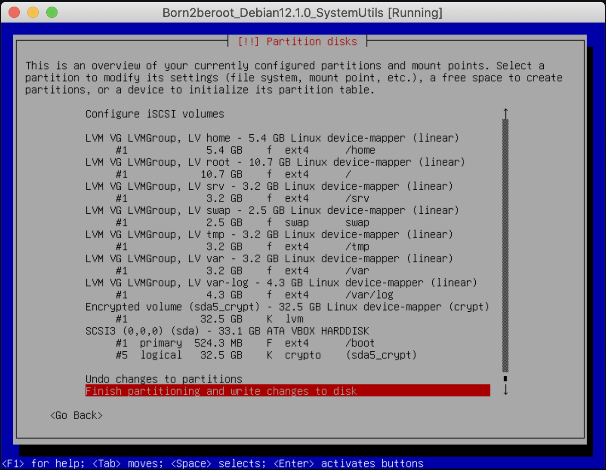
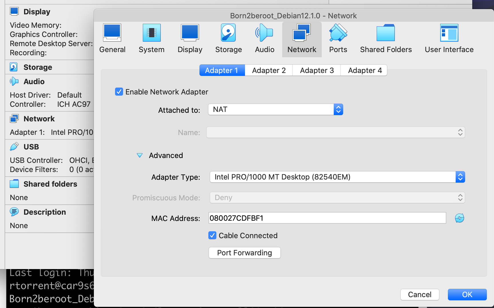

# Born2beroot

**Instructions for common-core-rank01/Born2beroot project, mandatory & *bonus* parts.**

Operating system: Debian "Bookworm" v12.1.0 
Virtualization software: Oracle VM VirtualBox v7.0.8

**NOTES**:
- User login throughout this file is `rtorrent`.
- Any other filename, password, or such marked with a (§) can and **should** be adapted to the user's personal preferences.
- A text file with user, root, and partition passwords should be kept at hand.
- Popular text editors available with the bare Debian build are **vi** and **nano**. **Emacs** requires an installation (`apt install emacs`) first. Commands in this tutorial reliant on a text editor are marked with (†).

---

## A.- Installing our virtual machine & setting the server

[Download](https://cdimage.debian.org/debian-cd/current/amd64/iso-cd/) the latest *stable* version of Debian. Currently, this will be image `debian-12.1.0-amd64-netinst.iso`.

Open VirtualBox and select **`New`**.

- You may determine your VirtualBox release version by executing in the CLI

		VBoxManage -v

---

### A.1 VirtualBox Settings

#### A.1.a Name and Operating System

> Name: `Born2beroot_Debian12.1.0` (§) 
> Folder: `cd /System/Volumes/Data/sgoinfre/Perso/rtorrent/` (§)
- Actual location of the `SGoinfre` folder in the 42 system might vary. A symbolic link in the root directory, `/sgoinfre`, is probably present.
- User's folder in the public directory may be further protected: `chmod go-rwx rtorrent` (§). Check the local rules governing `SGoinfre` in the `F.A.Q.` link of the *intra*.
> ISO Image: Should be located in the `Downloads` folder.
- Further boxes will autofill.
> `Skip Unattended Installation` **✓** this box

#### A.1.b Hardware

> Base Memory: Leave as recommended, 2048 MB. 
> Processors: In my experience, OS installation at 42's facilities **will crash** with more than `1` CPU selected. We *may* choose to increase the number after the installation is complete.

#### A.1.c Hard Disk

> `Create a Virtual Hard Disk Now` **☉** this button
- Hard Disk File location for the .vdi (VirtualBox Disk Image) should be automatically selected in our VM's folder.
- Increase size to `30.80 GB` for the *bonus* sections of this project. 
  [**NOTE**: Both Debian and VirtualBox use the *traditional* 1 GB = (1,024)^3 = 1,073,741,824 bytes. However, Debian's installer uses the *modern* 1 GB = 1,000,000,000 bytes, perhaps to accomodate hardware manufacturers' scheming of inflated HD sizes.]
- Do not *Pre-allocate Full Size*, as you will exceed your assigned space quota in disk.

After pressing **`Finish`**, the VM should be created in the `sgoinfre` subfolder of our choosing.

**`Start`** the VM.
- At all times, one can switch from the host to the guest sytem, and back, by pressing the `⌘` key.

---

### A.2 Installing Debian

**IMPORTANT: Immediately press the `↓` key in the keyboard to interrupt the *Graphic install* option. Select the *Install* option instead.**

Before continuing, resize the Machine's Window by pressing `⌘ + C`. Use the mouse to adjust the window to a comfortable size.

#### A.2.a Select a language

> Language: `English - English`

#### A.2.b Select your location

> Country, territory or area: `other` (§) 
> Continent or region: `Europe` (§) 
> Country, territory or area: `Spain` (§)

#### A.2.c Configure locales

> Country to base default locale settings on: `United States - en_US.UTF-8`

#### A.2.d Configure the keyboard

> Keymap to use: `American English`

#### A.2.e Configure the network

> Hostname: `rtorrent42` (§)
- As per instructions, hostname **must** be the user's 42 login ending with 42.
> Domain name: ` ` \<leave empty\>

#### A.2.f Set up users and passwords

> Root password: `Born2becute` (§) 
> Re-enter password to verify: `Born2becute` (§)
- Remember to store this and all passwords in a safe location.
- Root password should comply with all the restrictions listed in the pdf document.
- Checking the `Show Password in Clear` option is very helpful.
> Full name for the new user: `Roger Torrent` (§) 
> Username for your account: `rtorrent` (§)
- As per instructions, an account with the user's 42 login **must** be present.
> Choose a password for the new user: `Born2berude` (§) 
> Re-enter password to verify: `Born2berude` (§)
- Again, comply with the password policy.

#### A.2.g Configure the clock

> Select a location in your time zone: `Madrid` (§)

#### A.2.h Partition disks

> Partitioning method: `Manual` 
> `SCSI3 (0,0,0) (sda) - 33.1 GB ATA VBOX HARDDISK`
- Location for the new partition table. 
  [**NOTE**: The installer may revert to the SCSI1 or SCSI2 protocols. Don't worry over this.]
> Create new empty partition table on this device? `Yes` 
> `pri/log 33.1 GB FREE SPACE` 
> How to use this free space: `Create a new partition` 
> New partition size: `525`
- This will be `sda1` and contain the OS.
> Type for the new partition: `Primary` 
> Location for the new partition: `Beginning` 
> Partition settings:
>> Mount point: `/boot` \<After selecting `/boot - static files of the boot loader`\> 
>> `Done setting up the partition`
>
> `pri/log 32.5 GB FREE SPACE` 
> How to use this free space: `Create a new partition` 
> New partition size: `max`

Next, create a LV (Logical Volume) with the rest of the free space.
> Type for the new partition: `Logical` 
> Partition settings:
>> Mount point: `none` \<After selecting `Do not mount it`\> 
>> `Done setting up the partition`
>
> `Configure encrypted volumes` 
> Write the changes to disk and configure encrypted volumes? `Yes` 
> Encryption configuration actions: `Create encrypted volumes` 
> Devices to encrypt:
>> `[ ] /dev/sda1 (524MB; ext4)` 
>> `[*] /dev/sda5 (32544MB; ext4)`
- Encrypt only the logical volume.
> Partition settings:
>> `Done setting up the partition`
>
> Encryption configuration actions: `Finish` 
> Really erase the data on SCSI3 (0,0,0), partition #5 (sda)? `No`
- Should `Yes` be selected, interrupt the installer by pressing `Cancel` as it overwrites partition #5; it is safe, as there was nothing to hide.
> Encryption passphrase: `Born2beroot42` (§) 
> Re-enter passphrase to verify: `Born2beroot42` (§) 
> `Configure the Logical Volume Manager` 
> Write the changes to disks and configure LVM? `Yes` 
> LVM configuration action: `Create volume group`
- Selecting `Display configuration details` at any point of this stage of the installation will show the progress of the configuration as new volumes are included into the group.
> Volume group name: `LVMGroup`
- This is the name suggested in the project's document.
> Devices for the new volume group:
>> `[*] /dev/mapper/sda5_crypt (32527MB; ext4)` 
>> `[ ] /dev/sda1 (524MB; ext4)`

Create the seven encrypted partitions with LVM:
> LVM configuration action: `Create logical volume` 
> Volume group: `LVMGroup (32526MB)` 
> Logical volume name: `root` 
> Logical volume size: `10737`

And repeat for the next six volumes in the group!
> LVM configuration action: `Create logical volume` 
> Volume group: `LVMGroup (21793MB)` 
> Logical volume name: `swap` 
> Logical volume size: `2470` 
> LVM configuration action: `Create logical volume` 
> Volume group: `LVMGroup (19327MB)` 
> Logical volume name: `home` 
> Logical volume size: `5369` 
> LVM configuration action: `Create logical volume` 
> Volume group: `LVMGroup (13958MB)` 
> Logical volume name: `var` 
> Logical volume size: `3221` 
> LVM configuration action: `Create logical volume` 
> Volume group: `LVMGroup (10741MB)` 
> Logical volume name: `srv` 
> Logical volume size: `3221` 
> LVM configuration action: `Create logical volume` 
> Volume group: `LVMGroup (7524MB)` 
> Logical volume name: `tmp` 
> Logical volume size: `3221` 
> LVM configuration action: `Create logical volume` 
> Volume group: `LVMGroup (4307MB)` 
> Logical volume name: `var-log` 
> Logical volume size: `4307MB` \<leave unchanged\> 
> LVM configuration action: `Finish`

We now have to specify the use and mounting points for each of the volumes in the group:
>> `LVM VG LVMGroup, LV home - 5.4 GB Linux device-mapper (linear)` 
>> `#1 5.4 GB` \<select this row\>
>
> Partition settings:
>> Use as: `Ext4 journaling file system` 
>> Mount point: `/home` \<After selecting `/home - user home directories`\> 
>> `Done setting up the partition`

>> `LVM VG LVMGroup, LV root - 10.7 GB Linux device-mapper (linear)` 
>> `#1 10.7 GB` \<select this row\>
>
> Partition settings:
>> Use as: `Ext4 journaling file system` 
>> Mount point: `/` \<After selecting `/ - the root file system`\> 
>> `Done setting up the partition`

>> `LVM VG LVMGroup, LV srv - 3.2 GB Linux device-mapper (linear)` 
>> `#1 3.2 GB` \<select this row\>
>
> Partition settings:
>> Use as: `Ext4 journaling file system` 
>> Mount point: `/srv` \<After selecting `/srv - data for services provided by this system`\> 
>> `Done setting up the partition`

>> `LVM VG LVMGroup, LV swap - 2.5 GB Linux device-mapper (linear)` 
>> `#1 2.5 GB` \<select this row\>
>
> Partition settings:
>> Use as: `swap area`
- This partition does not use the Ext4 file system. No mount point required either. The *swap area* is the space where inactive memory pages are stored when the physical RAM memory runs out.
>> `Done setting up the partition`

>> `LVM VG LVMGroup, LV tmp - 3.2 GB Linux device-mapper (linear)` 
>> `#1 3.2 GB` \<select this row\>
>
> Partition settings:
>> Use as: `Ext4 journaling file system` 
>> Mount point: `/tmp` \<After selecting `/tmp - temporary files`\> 
>> `Done setting up the partition`

>> `LVM VG LVMGroup, LV var - 3.2 GB Linux device-mapper (linear)` 
>> `#1 3.2 GB` \<select this row\>
>
> Partition settings:
>> Use as: `Ext4 journaling file system` 
>> Mount point: `/var` \<After selecting `/var - variable data`\> 
>> `Done setting up the partition`

>> `LVM VG LVMGroup, LV var-log - 4.3 GB Linux device-mapper (linear)` 
>> `#1 4.3 GB` \<select this row\>
>
> Partition settings:
>> Use as: `Ext4 journaling file system` 
>> Mount point: `/var/log` \<After selecting `Enter manually` and typing `/var/log`\> 
>> `Done setting up the partition`

> `Finish partitioning and write changes to disk`

> Write the changes to disks? `Yes`

#### A.2.i Installing the base system

Installation of the OS at this stage may take a while.

#### A.2.j Configure the package manager

> Scan extra installation media? `No` 
> Debian archive mirror country: `Spain` (§) 
> Debian archive mirror: `deb.debian.org` 
> HTTP proxy information (blank for none): ` ` \<leave empty\>

#### A.2.k Configuring popularity-contest

> Participate in the package usage survey? `No`

#### A.2.l Software selection

> Choose software to install:
>> `[ ] Debian desktop environment` 
>> `[ ] ... GNOME                 ` 
>> `[ ] ... Xfce                  ` 
>> `[ ] ... GNOME Flashback       ` 
>> `[ ] ... KDE Plasma            ` 
>> `[ ] ... Cinnamon              ` 
>> `[ ] ... MATE                  ` 
>> `[ ] ... LXDE                  ` 
>> `[ ] ... LXQt                  ` 
>> `[ ] web server                ` 
>> `[*] SSH server                ` 
>> `[*] standard system utilities `
- Deselect all preselected options except for the last, and install the predefined SSH collection (OpenSSH). The `standard system utilities` option gives us access to the **man** pages of the commands. Alternatively, just deselect everything; later on you may install the precise packages yourself.

#### A.2.m Configuring grub-pc

> Install the GRUB boot loader to your primary drive? `Yes` 
> Device for boot loader installation: `/dev/sda (ata-VBOX_HARDDISK_VB6f2eb40c-0d001e88)`
- Obviously, the serial number above will be different in each case.

#### A.2.n Finish the installation

> `Continue`

Success! 
[**TIP**: Cloning the virtual machine after this lengthy installation is a sensible precaution before moving on.]

---

### A.3 Configuring the virtual machine

Henceforth, enter your Debian installation by pressing `Debian GNU/Linux` in the GNU GRUB loading screen, and unlock the encrypted partition:
> Please unlock disk sda5_crypt: `Born2beroot42` (§)

But before continuing, power the machine off and enable the ports.

#### A.3.a Setting the ports

Navigate to the `Network` menu, either by pressing the **`Settings`** button or the `Network` reticule of the machine's `Display` view. 
Expand to the `Advanced` options and press the **`Port Forwarding`** button.

Add a new rule (green button in the top right corner):
> `Name     Protocol    Host Port   Guest Port` 
> `Rule 1   TCP         1717        4242      ` (§)
- *Host port* may be any port of our liking, `1717` (§) in this case, but it **must** be rerouted to *guest port* `4242` in our virtual machine.

Turn the machine on and login as `root` user to continue with the project:
> rtorrent42 login: `root` (§) 
> Password: `Born2becute` (§)

#### A.3.b Secure Shell setup

A SSH server should be present in the machine from the software selection phase of the OS installation. You may test this with `service ssh status`. If this is not the case, install it now by typing `apt install openssh-server` and confirm with `y`.

Next, configure the daemon to suit the document's specifications. Open the main configuration file `/etc/ssh/sshd_config` with your preferred text editor, **vi** in my case:

		vi /etc/ssh/sshd_config (†)
- Observe that there is also a `ssh_config` file, a `ssh_config.d` folder, and a `sshd_config.d` folder in `/etc/ssh/`. Check your spelling!
- The config file basically consists of an `Include` directive to call further config files stored in the `sshd_config.d` folder, and a list of *commented out* settings (starting with the `#` character). These are the default settings the server runs on.

Uncomment `Port` selection in line 14, modifying the default port 22 **sshd** listens on:

		Port 4242

Uncomment `PermitRootLogin` selection in line 33 as, per instructions, "it must not be possible to connect using SSH as root":

		PermitRootLogin no

- Open the **man** page for further details, `man 5 sshd_config`. Again, the manual should be present in the system from the software selection phase. Should the package be missing, you may install it with `apt install man-db`. Confirm with `y`.

Restart the service to force the changes:

		service ssh restart

- Check with `service ssh status` that the listened port has indeed changed to 4242.

**sshd_config** configures the daemon that listens to any incoming connection request to the SSH port. By contrast, **ssh_config** configures the SSH client one uses to SSH *another* machine. The document does not mandate us to set a client in the virtual machine, and so we shan't tinker any further!

#### A.3.c Uncomplicated Firewall setup

		apt install ufw
> Do you want to continue? [Y/n] `⏎` \<a simple `y` in the keyboard would also suffice\>

Activate UFW for immediate use and enable it on system boot:

		ufw enable

As instructed in the document, port 4242 is left open:

		ufw allow 4242
- Confirm this is indeed the case with `ufw status`.

#### A.3.d Strong password policy

Open the configuration file that stores user account parameters, `/etc/login.defs`, with your preferred text editor:

		vi /etc/login.defs (†)

Find definition `PASS_MAX_DAYS` and edit from `99999` to the mandated `30`. 
Find definition `PASS_MIN_DAYS` and edit from `0` to `2`. 
Seven-day warning to password expiration (`PASS_WARN_AGE`) is correctly set to `7` by default.

		#
		# Password aging controls:
		#
		#       PASS_MAX_DAYS   Maximum number of days a password may be used.
		#       PASS_MIN_DAYS   Minimum number of days allowed between password changes.
		#       PASS_WARN_AGE   Number of days warning given before a password expires.
		#
		PASS_MAX_DAYS   30
		PASS_MIN_DAYS   2
		PASS_WARN_AGE   7
- In addition to password aging controls, the file directs other parameters, such as mailbox location and the password encryption method.
- This file is accessed by commands such as `useradd` and `groupadd`.
- Open the **man** page for further details, `man 5 login.defs`.

Some of the options in `login.defs` are obsolete and are handled by PAM (Pluggable Authentication Modules). So let us install the required PAM password management module next:

		apt -y install libpam-pwquality
- `-y` option spares us the confirmation request after the `apt` command.
- You may check if the package is installed with `dpkg -s libpam-pwquality`.

Password policies are defined in `/etc/pam.d/common-password`. Edit the file:

		vi /etc/pam.d/common-password (†)

Locate line 25:

		password   requisite   pam_pwquality.so   retry=3
Column 1, `password`, is the management group for the service, *Password group* in our case. Other groups we may find are *Auth*, *Account*, and *Session groups*. 
Column 2, `requisite`, is the *Control flag* in the service file. *Requisite* is the strongest flag. If the requisite is not found or failed to load, it will stop loading other modules and return failure. 
Column 3, `pam_pwquality.so`, is the *Module* (.so file) used. 
Column 4, `retry=3`, contains *Module parameters*. The document does not specify a number of retries—the default value is `1`—, so replace this parameter with the specified requirements:

		password   requisite   pam_pwquality.so   minlen=10 ucredit=-1 lcredit=-1 dcredit=-1 maxrepeat=3 reject_username difok=7 enforce_for_root
- All parameters should go in the same *line*, that is, before a newline character.

`minlen=10`: minimum acceptable size. 
`ucredit=-1`: minimum number of upper case letters. (‡) 
`lcredit=-1`: minumum number of lower case letters. (‡) 
`dcredit=-1`: minimum number of digits. (‡) 
`maxrepeat=3`: limit on repeated consecutive characters. 
`reject_username`: rejects the new password if it contains the login, either in straight or reversed form. 
`difok=7`: number of changes (inserts, removals, or replacements) in the new password vs the old. 
`enforce_for_root`: as per instructions!

(‡) **NOTE**: It is possible to use a *credit* system, wherein `ucredit`, `lcredit`, `dcredit` and `ocredit`—for *other*—are tallied against the `minlen` requirement. In this system, the value numbers are positive.

- You can list the Linux services that use Linux-PAM with `ls /etc/pam.d`
- For more details, open the **man** pages, `man 5 pam.d` and `man 8 pam_pwquality`.

Type `reboot` to restart the machine if you wish to try the new password conditions. The command to change passwords is `passwd [LOGIN]`. If no `LOGIN` is typed, the current user is presumed.
- Notice that the `root` user does not have to present the current password before typing a new one, neither for itself nor other users. Therefore, the minimum 7-character difference with the old password rule is not applicable to `root`, in accordance with the project document!

#### A.3.e sudo installation & configuration

**sudo** (superuser do) will allow any user to adopt omnipotent `root` abilities. Therefore, it must be be properly configured. Start by installing the `sudo` package:

		apt -y install sudo
-  You may print the **sudo** version string (and any configured plugin) with `sudo -V | more`

One could add to the main configuration file, `/etc/sudoers`, directly. But in it—try `visudo` in the command line interface—one reads that new content should be incorporated through the `/etc/sudoers.d` folder instead. Let's do that, calling the new config `Born2beroot`:

		vi /etc/sudoers.d/Born2beroot (§)(†)
- Any filename not ending with tilde `~` or containing a dot `.` will do.

**sudoers** mostly contains *users specifications* following the syntax `User Host = (Runas) Command`. This reads as *User may run Command as the Runas user on Host*.

`User` and `Runas` may by usernames, groupnames prefixed with `%`, numeric UIDs prefixed with `#`, or numeric GIDs prefixed with `%#`. 
`Host` may be a hostname, IP address, or a whole network. 
`Command` is the full path to an executable. 
Any or all of the above may be the special keyword `ALL`, valid for everyone, everywhere, and everything.
- The optional clause `Runas` controls the target user and group **sudo** will run the `Command` as. It determines which combinations of `-u` and `-g` will be valid with **sudo**. In its absence, the assumed identity will be *superuser*, i.e. `root`.
- It is possible to fine-grain the permissions to an incredible detail. For more information, check the **man** page at `man 5 sudoers` (paying special attention to the **Runas_Spec** section).

Type the following lines into the new file:

		Defaults	badpass_message="Prueba otra vez, bobo" (§)
		Defaults	log_input, log_output
		Defaults	iolog_dir="/var/log/sudo/"
		Defaults	iolog_file="logs" (§)
  		Defaults	logfile="/var/log/sudo/sudo.logs" (§)
		Defaults	requiretty
  		Defaults	secure_path="/usr/local/sbin:/usr/local/bin:/usr/sbin:/usr/bin:/sbin:/bin"

`badpass_message`: unfortunately, strict compliance with the project document bars the very colorful `Defaults   insults`! 
`log_input, log_output`: every input and output action has to be archived.
- Technically, we could list all the specs of this file into one single command, separated with commas.

`iolog_file`: path relative to `iolog_dir` where input and output streams will be recorded. 
`logfile`: human-readable log file. 
`requiretty` will only allow **sudo** commands coming out of a real tty terminal, not something like, say, a **cron** script (which we shall shortly prepare). 
`secure_path`: **sudo** will use this value in place of the user's PATH environment variable.
- Note that the example path in the document includes a `/snap/bin`. However, we don't have any **snap** applications packaged in our machine.

`Defaults   passwd_tries=3` is unnecessary as the default before **sudo** logs a failure and exits is already three attempts.

Finally, create the folder for the log files with `mkdir /var/log/sudo`. 
[**NOTE**: A first use of **sudo** from within `root` would also create this folder.]

#### A.3.f Adding new groups

You can find all the groups in the database stored in the `/etc/group` file, including their GID numbers and members. If you are interested in printing their names only, consider using the following piped commands:

		awk -F : '{print $1}' /etc/group | sort | more

To figure out the groups the current user is a member of, type `id -Gn`. Now switch from the `root` user you are (probably) logged as, to your typical login account—`su rtorrent` (§)—, and try again. You may return to `root` with a simple `exit` command. But before you do, attempt to use **sudo** from the ordinary account: `sudo echo "Hello"`. You should get an error message ("XXX is not in the sudoers file.") because user XXX is not a member of the `sudo` group.

Back as `root`, create the new `user42` group the document asks for AND include the ordinary-login user to it:

		groupadd user42 -U rtorrent (§)

Now add the same user to the `sudo` group with one of the following commands,

		groupmod sudo -aU rtorrent (§)

or alternatively,

		usermod rtorrent -aG sudo (§)

Both edit the user's details and the group's membership. 
[**NOTE**:  The `-a` option (*append*) is crucial. Without it, the command will completely replace the user/group lists. This is not important with the `groupmod` command **in this case**—because we start with an empty group—, but it would be dramatic in the case of `usermod` to expel the user from all groups, including their own primary group, just to get them into `sudo`!]
- Open the **man** pages for further details: `man 8 groupadd`, `man 8 groupmod`, and `man 8 usermod`.

Double-check everything went right with `id rtorrent -Gn` (§). If you switch users again, **sudo** should now work with the login user.

There is an alternative solution to the commands used in this section: `addgroup` and `adduser`. These are actually *interactive* Perl scripts working with the original bin commands. You may locate them with `which addgroup` and `which adduser`, and find more information in the **man** page, common for both, `man 8 adduser`.

#### A.3.g Simple script

The next task is to write a Bash script, **monitoring.sh**. We choose to place this script in the `/usr/local/sbin` folder, which conveniently is included in the PATH environment variable of our Linux system. (You can check this fact with `printenv PATH`.) Thus placed, the script can be executed everywhere without specifying its full path.

Using *everyone's* favorite text editor,

		vi /usr/local/sbin/monitoring.sh (†)

type the following Bash commands:

		#!/bin/bash

		# Architecture of OS & kernel version
		arch=$(uname -srvmo)

		# Physical processors
		pcpu=$(lscpu | awk -F : '
			/^Core\(s\) per socket/ {mult=$2}
			/^Socket\(s\)/ {mult*=$2}
			END {print mult}')

		# Virtual processors
		vcpu=$(nproc --all)

		# RAM available/total MB (%)
		rama=$(free -m | awk '/^Mem:/ {print $7}')
		ramt=$(free -m | awk '/^Mem:/ {print $2}')
		ramp=$(printf '%.2f' $((10000*rama/ramt))e-2)

		# DISK available/total GB (%)
		dska=$(printf '%.2f' $(((df -x tmpfs -x devtmpfs --total | grep ^total | awk '{print $4}')*100/1024/1024)e-2))
		dskt=$(printf '%.2f' $(((df -x tmpfs -x devtmpfs --total | grep ^total | awk '{print $2}')*100/1024/1024)e-2))
		dskp=$(printf '%.2f' $((10000*dska/dskt))e-2)

		wall "Architecture: $arch
		Physical processor(s): $pcpu
		Virtual processor(s): $vcpu
		Available memory: $rama/$ramt MB ($ramp%)
		Available disk space: $dska/$dskt GB ($dskp%)"

Finally, change the permissions on the script so everybody can actually execute it:

		chmod +x /usr/local/sbin/monitoring.sh

`Architecture`: command `uname -a` (or `uname --all`) prints *all* system information, including the unsolicited newtwork node hostname (`rtorrent` (§)). 
`Physical processor(s)`: command `lscpu` displays information on the CPU architecture. The number of physical cores is the product of `Core(s) per socket` with `Socket(s)`. Line `CPU(s)` actually displays the number of *logical* cores, that is, the physical number just calculated multiplied by the *hyper-threads* in each core, `Thread(s) per core`.
- An alternative (and convoluted) route is to read the contents of the `/proc/cpuinfo` text file. A plethora of data is printed for the *logical* CPUs, each with a unique processor number: 
 `processor`: identifies the logical processor. 
 `physical id`: identifies the socket. 
 `siblings`: number of threads on the socket. 
 `core id`: identifies the core on a socket. 
 `cpu cores`: number of cores on the socket. 
 *Hyper-threading* is engaged when `siblings` differs to `cpu cores`. The number of `processor` entries divided by the *hyper-threads* (`siblings`/`cpu cores`) equals the physical cores present.

`Virtual processor(s)`: command `nproc --all` prints all installed processors.
- The `nproc` command is often used in shell scripts to check the number of available threads.
- Alternatives include `lscpu | awk -F : '/^CPU\(s\)/ {print $2}' | sed 's/ //g'` and `grep -c processor /proc/cpuinfo`.

`Available memory`: command `free` uses the data provided by file `/proc/meminfo`. Available memory is an estimation of how much memory is avaliable for starting new applications without relying on swapping. It considers memory lost to paging and other unclaimable bits. Memory total is below the theoretical installed (i.e., 2,048 MB) because the kernel keeps some for itself. Another chunk is probably gobbled by the hardware.
- The default size in `free` and `/proc/meminfo` is 1 kB = 1,024 bytes.

`Available disk space`: command `df` (disk filesystem) checks disk usage on a mounted filesystem, in 1 kB blocks. Unfortunately, the command includes some *tmpfs* (temporary file system) and one *devtmpfs* for device files (the interfaces between actual physical devices and the user). Both are virtual filesystems created to store files in volatile (RAM) memory… Option `-x` excludes those entries and option `--total` conveniently adds the columns for us. Giga-sized blocks (option `-BG`) are too coarse for an accurate measurement.

[**NOTE**: The number or processors dedicated to the VM was inceased to 2.]
